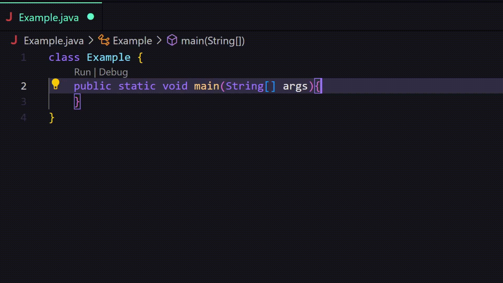

# aftall README

This extension for Visual Studio Code automatically puts ";" after each line (where required) by pressing the Enter key.

## Features

It speeds up writing code a bit, and also makes it easier for novice programmers to work with programming languages that require a ";" after each line, such as C++ or Java.

## Versions
### 1.0.0

Release of the first version of the extension

### 1.0.1;

Fixed the setting ";" after functions and methods written via "@" such as @Override in Java